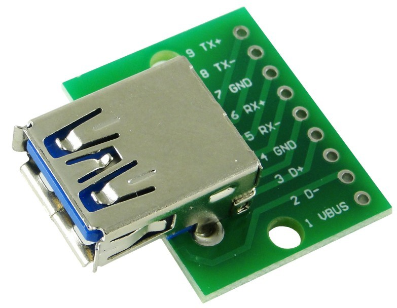

# [SEGA Megadrive/Genesis](https://en.wikipedia.org/wiki/Sega_Genesis) core for Terasic DE2-115 board.

Русскую версию README смотрите в [README_RUS.md](https://github.com/mindstation/DE2_115_Genesis/blob/de2115porting/README_RUS.md)

This is the port of the [Genesis_MiSTer](https://github.com/MiSTer-devel/Genesis_MiSTer) core.

Genesis_MiSTer is based on fpgagen.

fpgagen - a SEGA Megadrive/Genesis clone in a FPGA for Terasic DE2, MiST and Turbo Chameleon 64. Copyright (c) 2010-2013 Gregory Estrade (greg@torlus.com)
All rights reserved

The project DE2_115_Genesis was created with Quartus Prime 17.0.2 Lite Edition.

## Installing

Write ROM to a FLASH memory of the DE2-115 by "Terasic-DE2-115 Control Panel":

1. select FLASH memory type
2. erase FLASH chip (repeat before every ROM write)
3. in Sequential Write block set "File Length" option
4. in Sequential Write block open ROM file using "Write a File to Memory" button

Load "output_files/DE2_115_Genesis.sof" to the board. ROM image will copying automatically from FLASH to SDRAM when LEDR0 lights up.
ROM runs automatically after its had copied and LEDR0 gone out.
 
ROM size is set by the ROM header. Only exception is Super Street Fighter 2 New Challengers. SSF2 NC has hardcoded 5 MB size in the core.

## Board keys

* SW[16] - Genesis RESET
* SW[15] - enable/disable gamepads ports
* SW[5]  - joystick_0_B, SW[4] - joystick_0_C, SW[3] - joystick_0_Left, SW[2] - joystick_0_Up, SW[1] - joystick_0_Down, SW[0] - joystick_0_Right
* KEY[3] - joystick_0_START, KEY[2] - joystick_0_A
* SW[12] - joystick_1_B, SW[11] - joystick_1_C, SW[10] - joystick_1_Left, SW[9] - joystick_1_Up, SW[8] - joystick_1_Down, SW[7] - joystick_1_Right
* KEY[1] - joystick_1_START, KEY[0] - joystick_1_A

## Genesis and Mega Drive gamepads

Switch on SW[15] for gamepads use. It will disable Gamepads emulation by onboard SW and KEY.

3 or 6 buttons gamepad can be connected to GPIO. Like other Genesis accessories.

A cheap 3.3V connection option see in "schematics/DE2-115 Genesis and Mega Drive gamepads 3V3 adapter.pdf". This is suitable for accessories are working with 3.3V power supply. Gamepads work. The scheme is not recommended use with Zero Tolerance Link Cable.

See "schematics/DE2-115 Genesis and Mega Drive gamepads 5V SNAC adapter.pdf" for a 5V connection by a MiSTer SNAC logic level converter module. This option is probably compatible with any Genesis accessories.

### GPIO cheap 3.3V connection

Connection list for player 1 and player 2 gamepads:

* JP5 pin 2, JP5 pin 4, JP5 pin 6, JP5 pin 8, JP5 pin 10, JP5 pin 12, JP5 pin 14, JP5 pin 16, JP5 pin 29 - gamepad 1 (C/Start, B/A, Right/Mode, Select, Left/X, GND, Down/Y, Up/Z, 3.3V)
* JP5 pin 26, JP5 pin 28, JP5 pin 30, JP5 pin 32, JP5 pin 34, JP5 pin 36, JP5 pin 38, JP5 pin 40, JP5 pin 29 - gamepad 2 (Up/Z, Down/Y, GND, Left/X, Select, Right/Mode, B/A, C/Start, 3.3V)

Mega Drive and Genesis 6-buttons gamepad pinout list (3.3V power):

pin 1 - Up/Z, pin 2 - Down/Y, pin 3 - Left/X, pin 4 - Right/Mode, pin 5 - 3.3V,
pin 6 - B/A, pin 7 - "Select" buttons set, pin 8 - GND, pin 9 - C/Start

Contact numbering at gamepad connector is from right to left by rows. The first right pin in the upper row is pin 1. The last one is pin 5. The first right pin in the bottom row is pin 6. The last one is pin 9.

Most Genesis and Mega Drive gamepads work fine with 3.3V power. If your gamepads don't, then try 5V connection scheme based on MiSTer SNAC logic level converter module.

### GPIO connection using MiSTer SNAC

The GPIO connection list for MiSTer SNAC ports player 1 and player 2:

* JP5 pin 2, JP5 pin 4, JP5 pin 6, JP5 pin 8, JP5 pin 10, JP5 pin 12, JP5 pin 14, JP5 pin 16, JP5 pin 11 - player 1 SNAC port (USB pin 9, USB pin 8, USB pin 7, USB pin 6, USB pin 5, USB pin 4 (GND), USB pin 3, USB pin 2, USB pin 1 (5V))
* JP5 pin 11, JP5 pin 26, JP5 pin 28, JP5 pin 30, JP5 pin 32, JP5 pin 34, JP5 pin 36, JP5 pin 38, JP5 pin 40 - player 2 SNAC port (USB pin 1 (5V), USB pin 2, USB pin 3, USB pin 4 (GND), USB pin 5, USB pin 6, USB pin 7, USB pin 8, USB pin 9)

USB 3.0 connector module can be used for a MiSTer SNAC connection. See next picture for the module example.

## Files description

File name                                               | File description
--------------------------------------------------------|----------------------------------------------------------------------------
de2115_board                                            | The folder holds DE2-115 specific modules
output_files/DE2_115_Genesis.sof                        | FPGA configuration for loading by JTAG
output_files/DE2_115_Genesis.jic                        | Persistent FPGA configuration
rtl                                                     | The Genesis/Mega Drive core modules
schematics                                              | Genesis and Mega Drive gamepad ports connection diagrams
simulation/testbench                                    | Project testbenches, load a "*.do" script in Altera ModelSim for simulation
sys                                                     | MiSTer framework modules (the project top-level module is here)
DE2_115_Genesis.qpf                                     | Main Quartus project file
DE2_115_Genesis.qsf                                     | Quartus project settings file
Genesis.sdc                                             | Constraints for the core
Genesis.sv                                              | Top-level module of the core
LICENSE                                                 | GPL-3.0 License
README.md                                               | This readme file
README_RUS.md                                           | Russian readme file
files.qip                                               | The core files list (Quartus IP file)

## Known issues

* Virtual Racing does not work.
* No Save RAM backup.
